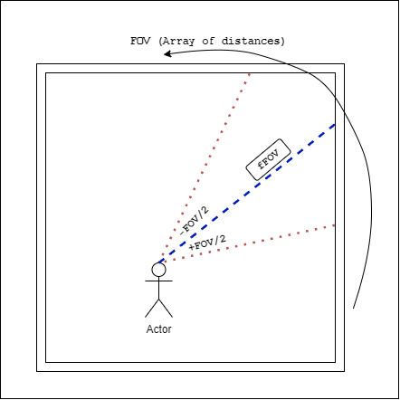
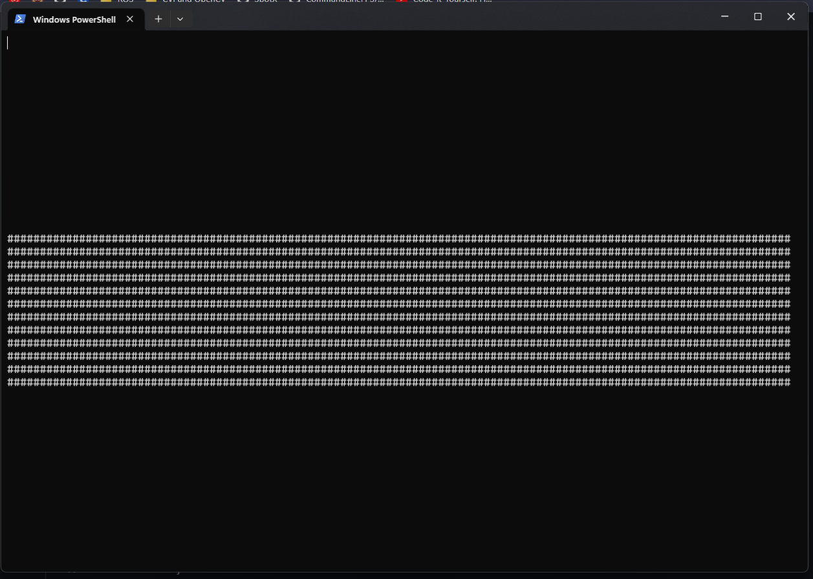
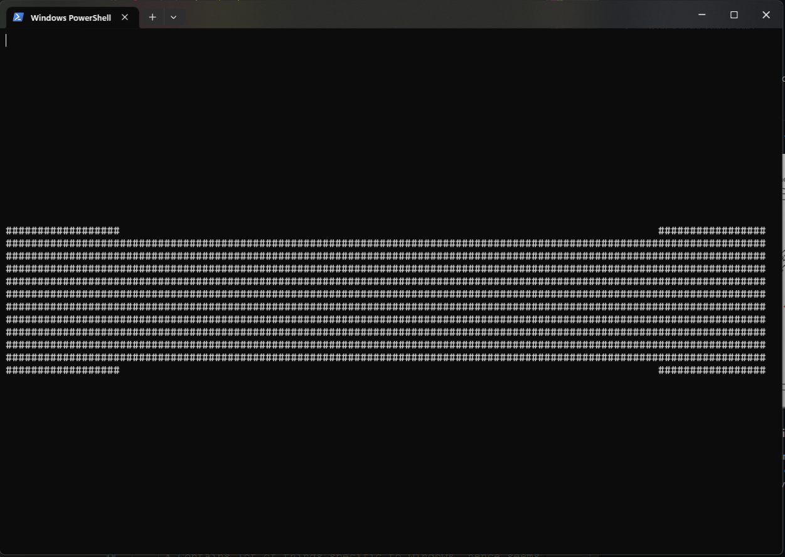

# ASCII-Ray-Tracing-cpp

## Usage
Firstly, set the CLI window display size to 120x40 (some users might need to use 121x41 depending on the windows version)

In windows powershell, go/create your desired directory and clone this repository and cd into it
```bat
make
.\ray_tracing.exe
```
*Controls*
* `W` - Forward
* `S` - Backward
* `A` - Left 
* `D` - Right

## Approach for Building

Firstly, `std::cout` isn't going to work since the time taken is much higher than directly writing on the console. Hence we will use conventional `printf` or similar methods and its variants for our main display. Later figured out printing to screen buffer is even better.

### Made a screen buffer of size `120x40`
Using `windows.h` created a screen buffer using `createConsoleScreenBuffer()` and service to print directly onto it any desired manner using the coordinates using the `WriteConsoleOutputCharacterW()` method.

### Made a basic Map
* Made a 16X16 map to move around and demonstrate the basic ray tracing
* `#` represent the wall
* `.` represent the empty space
<!-- * `P` represent the player position -->

### Initialised the main Game Loop
Just simply using `while(true)` for now for the continuous rendering.

## Algorithm
The following image contains the player, the wall and the FOV of the player in the game (red dotted line).



### Distance and Ray angle calculation

> General Conventions :
> * $[P_x,\ P_y]$ = current player position on map
> * $\alpha_r$ = ray angle
> * $\alpha_{p}$ = player angle
> * $\theta$ = FOV
> * $d$ = distance to wall

We calculate the distance to the wall by incrementing until the flag `hitWall` becomes true. (Depicted by the blue dashed line).
If the point of calculation is out of bounds, we set it to the defined depth. Else we can continue until it reaches a wall and use the incremented value as the distance to wall.

$$
\alpha_r = \left(\alpha_p - \frac{\theta}{2}\right) + \frac{x_{iter}}{w_{scr}} \cdot \theta
$$

Then we can define a unit vector `eye` to depict the direction of the ray using the ray angle obtained 

$$\hat{e} = [sin(\alpha_r),\ cos(\alpha_r)]$$

Then we make integral test vectors to determine the position using the $\hat{e}$ we just made. Simply $$\vec{T} = [P_x,P_y] + d\hat{e}$$ is the test vector. Using this and the map boundaries, we decide the distance to wall, either is the iterative value, or the maximum depth.

### Ceiling and Flooring
This part is fairly easy and just involves some perspective. Upper half of the screen will have the ceiling and farther the wall is, lower the ceiling.

$$c = \frac{h_{scr}}{2} - \frac{h_{scr}}{d}$$

$$f = h_cr - c $$

### Results so far
We print to the buffer column wise having a wall visible with the `#` and floor and ceiling as empty spaces.

```cpp
for(int y=0; y<screenHeight; y++){
    screen[y*screenWidth + x] = ((y<=ceiling)?' ':((y>ceiling&&y<=floor)?'#':' '));
}
```

 Two spawns $(8.0,8.0,0.0)$ and $(8.0,8.0,\frac{\pi}{4})$ are shown based on the current code






## Movement

`GetAsyncKeyState()` return a short integer whose most significant digit is 1. Hence, to check if it's pressed,  we can us the bitwise `&` with a bitmask. Hence we structure the if statement like 
``` cpp
if (GetAsyncKeyState('A') & 0x8000) {/*...*/}  //for all kinds of movements
```
0x8000 is 1000000000000000 in binary, hence we get `1` if the key is pressed, and get `0` if it's not pressed.
Begin with an arbitary increment and dcrement in the `playerA` and take input using the `GetAsyncKeyState()`. Turns out that the movement is very fast and we need to time it according to the fram rate we are recieving.

Fixed by multiplying the angular speed to the frame time (calculated using `std::chrono`).

Hence, 
* for rotations, we simply increment or decrement the angles (maybe set an angular speed variable later on).
* For position, we simply transform the coordinates in the Player frame and traverse using the additions of sines and cosines of `playerA` to the current position with a given speed.

## Shading


